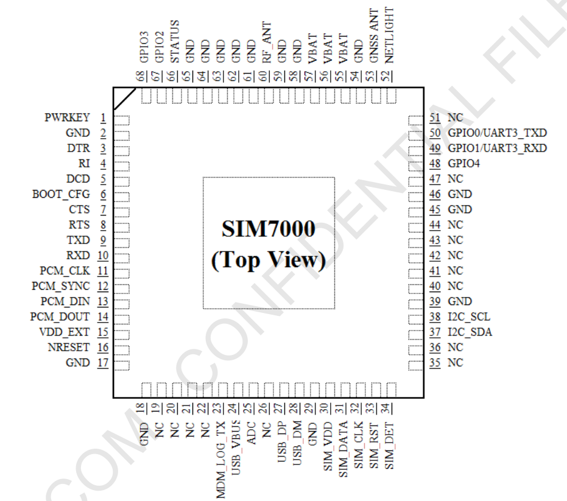

# Modem Information
## Hardware
Simcom's SIM7000E module seems to be based on the [MDM9206](https://www.qualcomm.com/products/mdm9206-iot-modem) chip produced by qualcomm. It's however really hard to get any information or datasheet from qualcomm (trust me, I tried) without having a company and signing lots of NDAs. However there is some information and headers provided by simcom. Some features include:

* Support for LTE CAT-M1 and CAT-NB1 (or how marketing calls it:5G)
* Support for E-GPRS (2G) for regions where 5G is not available
* Support for GPS, GLONASS, Beidou and soon Galileo
* Builtin ARM Cortex A7 with up to 1.3GHz
* 1 Fully usable UART
* TX only UART
* Builtin TCP/IP, MQTT, HTTP, CoAP, LWM2M stacks
* Operational directly from single cell lipo
* Builtin LDO regulator to supply external electronics
* &gt;16MB flash filesystem
* Embedded OS with support for threading, memory management, etc (ThreadX ?)
* ~3MB Ram (Code and Dynamic data)

Pin | Name | Description
----|------|------
1   | PWRKEY |Used to turn module on/off
2,17,18,29,39,45,46,54,58,59,61-65 | GND | Battery minus (GND)
55,56,57 | VBAT | Battery plus (3.0V ~ 4.3V)
15 | VDD_EXT | LDO Output (1.8V, max 50mA), only active if modem is on
16 | NRESET  | Module reset
24,27,28 | USB | USB Interface
3-5,7-10 | AT-UART | Serial AT interface
30-34 | SIM | Simcard
25 | ADC | Analog digital converter input (0V ~ VBAT)
37,38 | I2C | I2C Interface
11-14 | PCM | PCM interface 
52 | NETLIGHT | Used as network status indication
66 | STATUS | Status LED (High if on and firmware ready)
50 | GPIO0 | GPIO or Usart 3 TX inside Module
49 | GPIO1 | GPIO or Usart 3 RX inside Module
67 | GPIO2 | GPIO
68 | GPIO3 | GPIO
48 | GPIO4 | GPIO
53 | GNSS_ANT | GNSS Antenna
60 | RF_ANT | GPRS/LTE Antenna
6 | BOOT_CFG | USB Boot key, pull to VDD_EXT to force USB Download mode
23 | MDM_LOG_TX | Module log output, uart0 inside DAM [sampleoutput](bootlog.txt)

## Software
As far as I know the firmware is based on ThreadX, however the bootlog that gets dumped on pin 23 during startup suggests it's a linux system.
All interaction is done through a mechanism similar to syscalls.