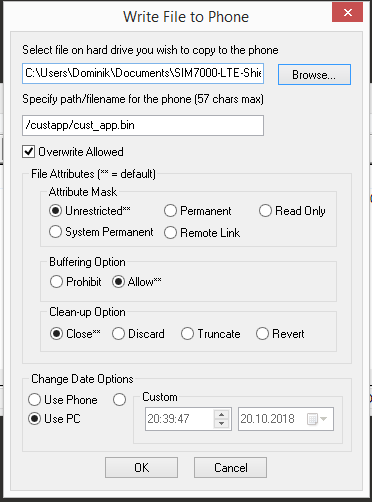

# Download and run a DAM on the modem
## Required Tools
* Qualcomm QPST (EFS Explorer)
* Simcom Module connected via USB

## Setting up
In order to download modules to your modem you need to use Qualcomm's QPST EFS Explorer, which unfortunately isn't available freely. It is however available from various websites which use it to revive bricked phones. Find a source and install it. If you get an error message about a missing Internet Explorer try a newer version (Version 2.7 Build 438 seems to work). Open "QPST Configuration" and navigate to the "Ports" tab. Click on "Add new Port" and enter the Diagnostics port of your module. If you did everything correctly your phone tab should look similar to this.


## Uploading a DAM
To upload a DAM to your Modem you need to open "EFS Explorer". You can do this either from within QPST Configuration by clicking on "Start Clients" => "EFS Explorer" or by directly starting "EFS Explorer" from the windows start menu.
A new window and a Phone selection dialog should appear. Select your Modem (if not preselected) and click on OK. "EFS Explorer" will now load the contents of the Embedded Filesystem. We need to upload our DAM to the modem's alternate Filesystem. To select it click on the blue/green cylinder icon:


Select the folder "custapp" or create it if there is none and upload your DAM to the folder by right clicking in the right folder view and selecting "Copy Data File from PC". In the new dialog select your DAM image using the "Browse" button and make sure the opions match those in the following image. It is mandatory to name your file "cust_app.bin" on the phone or it won't load.



Once done you can reset your modem and you should see your module start running.

## Linux
Once you connect your module using USB to a modern linux machine 5 new tty devices should appear. `dmesg` should output something similar to this:
```
[19146.558820] usb 3-1: new high-speed USB device number 10 using xhci_hcd
[19146.703843] usb 3-1: New USB device found, idVendor=1e0e, idProduct=9001
[19146.703848] usb 3-1: New USB device strings: Mfr=3, Product=2, SerialNumber=4
[19146.703850] usb 3-1: Product: SimTech SIM7000
[19146.703853] usb 3-1: Manufacturer: SimTech, Incorporated
[19146.703855] usb 3-1: SerialNumber: 1234567890ABCDEF
[19146.706232] option 3-1:1.0: GSM modem (1-port) converter detected
[19146.706443] usb 3-1: GSM modem (1-port) converter now attached to ttyUSB0
[19146.706639] option 3-1:1.1: GSM modem (1-port) converter detected
[19146.706898] usb 3-1: GSM modem (1-port) converter now attached to ttyUSB1
[19146.707091] option 3-1:1.2: GSM modem (1-port) converter detected
[19146.707256] usb 3-1: GSM modem (1-port) converter now attached to ttyUSB2
[19146.707452] option 3-1:1.3: GSM modem (1-port) converter detected
[19146.707609] usb 3-1: GSM modem (1-port) converter now attached to ttyUSB3
[19146.707827] option 3-1:1.4: GSM modem (1-port) converter detected
[19146.707998] usb 3-1: GSM modem (1-port) converter now attached to ttyUSB4
```
Note that ttyUSB names might differ if you already have a USB2Serial adapter connected, however the order should stay the same. The function of the interfaces is as following:

ID | Function
---|---------
0  | Diagnostic interface (This is the one we use to upload firmware)
1  | GPS NMEA Interface (GPS Info gets output here, needs to be enabled using AT)
2  | AT Port (Allows sending AT commands)
3  | Modem Port (Could be used to connect to the internet via this modem)
4  | USB Audio Port

There is an cross plattform c++ implementation of the qualcomm debug protocol here [libopenpst](https://github.com/openpst/libopenpst) and I maintain [a fork of it](https://github.com/Thalhammer/libopenpst/tree/efs_write) where I fixed some bugs, implemented efs writing and improved performance. Based on it I'm going to slowly build a toolset for building and uploading modules.

## Troubleshooting
### My image does not load
Make sure you did upload it to the correct filesystem and you named it correctly.
### My module reboots and appears as QHSUSB_BULK
Most likely your DAM crashes before initialisation is done or you really screwed up the header.
Take a look at [debricking](Debricking.md) to find out how to recover.
### API calls do not work as expected
If some of the api calls do not work as expected, try reflashing the firmware (not your module, the actual modem
firmware). Take a look at [debricking](Debricking.md) on how this can be done. Even if your module seems to work fine,
there might be something wrong that causes this behaviour. I had the case where the builtin mqtt client ignored the supplied clientid
and always used an empty value. After reflashing the firmware and retrying the exact same dam module (not even rebuilt) it worked fine.